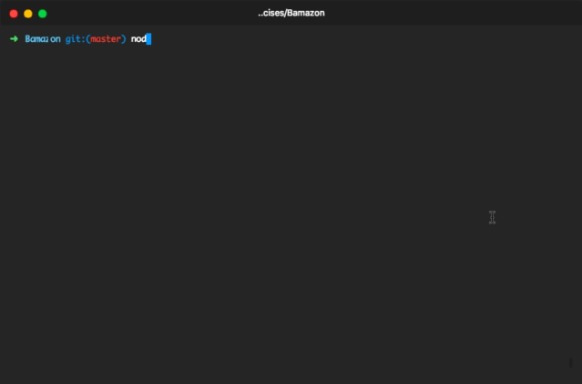

# Bamazon

This is a small app that demonstrates how you can use MySQL combined with Node.js to make a simple CLI interface that can allow you to track sales across a variety of user roles.

The app uses the NPM packages 
* Inquirer
* MySQL (npm package)
* console.table

## Demonstration
* This is a short demo of how the customer functionality works. You can view a table of products for sale, their departments, their price, and their quantity.  

** This is a short demo of what happens when you attempt to purchase more than what is currently in stock for a certain item.  
  

* This is a demonstration of how the manager functionality works. You can view all the products for sale, view products that are low on inventory (currently < 5 ), add more quantity to the inventory for specific products, and add new products entirely.  

* The supervisor functionality is currently incomplete. The supervisor will be able to add departments and view product sales by department.  